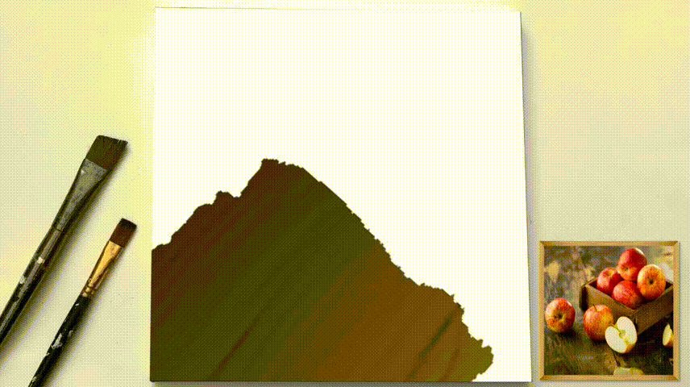
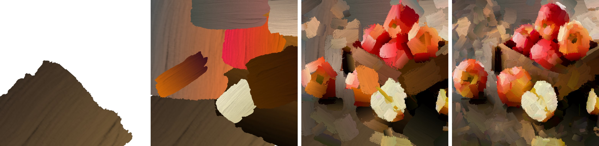
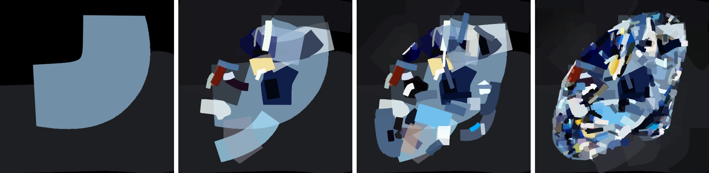
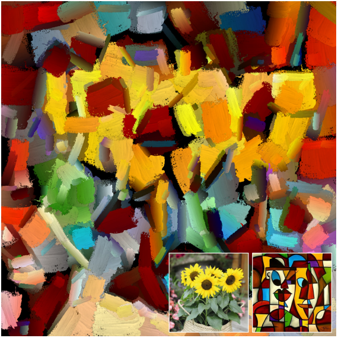

# neuralPainting




## live demo and say thanks

[](https://colab.research.google.com/drive/1N7VyYRvCUEZvK_qbiWu_YC1QCP01E9Wb#scrollTo=jt6O3GvhvK3i)
[](https://colab.research.google.com/drive/1gsLWqMmHcDUoQ3BmUh8gPRhkccrZs8_R?usp=sharing)
[](https://saweria.co/slowy07)

## paper

[artistic image painting using artificial intelligence - Arfy Slowy](https://bit.ly/3AHmStJ)

## how use my photos

you can save at [`style_images`](./style_images) (example image on this folder) or create custom path

image on demo

- [Jeon somi](test_images/somi.jpg)
- [Sunflowers](test_images/sunflowers.jpg)

download one of pretrained neural renderers from google drive

- [oil-paint-brush](https://drive.google.com/file/d/1sqWhgBKqaBJggl2A8sD1bLSq2_B1ScMG/view)
- [watercolor ink](https://drive.google.com/file/d/19Yrj15v9kHvWzkK9o_GSZtvQaJPmcRYQ/view?usp=sharing)
- [marker pen](https://drive.google.com/file/d/1XsjncjlSdQh2dbZ3X1qf1M8pDc8GLbNy/view?usp=sharing)
- [color tapes](https://drive.google.com/file/d/162ykmRX8TBGVRnJIof8NeqN7cuwwuzIF/view?usp=sharing)

## (my) requirement testing


i'm using training on computer with 8 core of CPU AMD ryzen 7 4800H and 16GB memory. so, i had to take into consideration computational complexity and memory limitations.i've tried several gpu devices with low memory, and some worked and some didn't work, you can try it and give your feedback by posting on the [issue](https://github.com/slowy07/neuralPainting/issues)

## testing

```bash
unzip checkpoints_G_oilpaintbrush.zip
unzip checkpoints_G_rectangle.zip
unzip checkpoints_G_markerpen.zip
unzip checkpoints_G_watercolor.zip
```

We have also provided some lightweight renderers where users can generate high-resolution paintings on their local machine with limited GPU memory. Please feel free to download and unzip them to your repo directory

- [oil-paint-brush (light)](https://drive.google.com/file/d/1kcXsx2nDF3b3ryYOwm3BjmfwET9lfFht/view)
- [watercolor ink (light)](https://drive.google.com/file/d/1FoclmDOL6d1UT12-aCDwYMcXQKSK6IWA/view?usp=sharing)
- [marker pen (light)](https://drive.google.com/file/d/1pP99btR2XV3GtDHFXd8klpdQRSc0prLx/view?usp=sharing)
- [color tapes (light)](https://drive.google.com/file/d/1aHyc9ukObmCeaecs8o-a6p-SCjeKlvVZ/view?usp=sharing)

```bash
unzip checkpoints_G_oilpaintbrush_light.zip
unzip checkpoints_G_rectangle_light.zip
unzip checkpoints_G_markerpen_light.zip
unzip checkpoints_G_watercolor_light.zip
```

## to produce the result

<p align="center">
    
</p>

progressive rendering

```bash
python3 demo_prog.py --img_path ./test_images/apple.jpg --canvas_color 'white' --max_m_strokes 500 --max_divide 5 --renderer oilpaintbrush --renderer_checkpoint_dir checkpoints_G_oilpaintbrush --net_G zou-fusion-net
```

progressive rendering with lightweight (with lower GPU memmory and faster speed)

```bash
python3 demo_prog.py --img_path ./test_images/apple.jpg --canvas_color 'white' --max_m_strokes 500 --max_divide 5 --renderer oilpaintbrush --renderer_checkpoint_dir checkpoints_G_oilpaintbrush_light --net_G zou-fusion-net-light
```

rendering directly from mxm image grids

```bash
python3 demo.py --img_path ./test_images/apple.jpg --canvas_color 'white' --max_m_strokes 500 --m_grid 5 --renderer oilpaintbrush --renderer_checkpoint_dir checkpoints_G_oilpaintbrush --net_G zou-fusion-net
```

<p align="center">
    
</p>

progressive rendering

```bash
python3 demo_prog.py --img_path ./test_images/diamond.jpg --canvas_color 'black' --max_m_strokes 500 --max_divide 5 --renderer markerpen --renderer_checkpoint_dir checkpoints_G_markerpen --net_G zou-fusion-net
```

progressive rendering with lightweight (with lower GPU memmory and faster speed)

```bash
python3 demo_prog.py --img_path ./test_images/diamond.jpg --canvas_color 'black' --max_m_strokes 500 --max_divide 5 --renderer markerpen --renderer_checkpoint_dir checkpoints_G_markerpen_light --net_G zou-fusion-net-light
```

rendering directly from mxm image grids

```bash
python3 demo.py --img_path ./test_images/diamond.jpg --canvas_color 'black' --max_m_strokes 500 --m_grid 5 --renderer markerpen --renderer_checkpoint_dir checkpoints_G_markerpen --net_G zou-fusion-net
```

## network architecture

We build our shading network similiar to [Deep Convolutional Generative Adversarial Network](https://www.tensorflow.org/tutorials/generative/dcgan) (DCGAN), which consist of six transposed conv layers. We remote Tanh activation from the output layer and observe a better convergence. In from the output layer and observe a better convergence.

## details configurations of neural renderer

**details of shading network**
| | Layers | Config | Out size |
| :--- | :----: | :----: | ---:|
| C1 | Deconv + BN + ReLU | 512 x 4 x 4 / 1 | 4 x 4 x 512 |
| C2 | Deconv + BN + ReLU | 512 x 4 x 4 / 2 | 8 x 8 x 512 |
| C3 | Deconv + BN + ReLU | 256 x 4 x 4 / 2 | 16 x 16 x 256 |
| C4 | Deconv + BN + ReLU | 128 x 4 x 4 / 2 | 32 x 32 x 128 |
| C5 | Deconv + BN + ReLU | 64 x 4 x 4 / 2 | 64 x 64 x 64 |
| C6 | Deconv + BN + ReLU | 3 x 4 x 4 / 2 | 128 x 128 x 3 |

**rasterization network**
| | Layers | Config | Out size |
| :--- | :----: | :----: | ---:|
| F1 | Full-connected + ReLU | 512 | 512 |
| F2 | Full-connected + ReLU | 1024 | 1024 |
| F3 | Full-connected + ReLU | 2048 | 2048 |
| F4 | Full-connected + ReLU | 4096 | 3096 |
| V1 | View | - | 16 x 16 x 16 |
| C1 | Conv + ReLU | 32 x 3 x 3 / 1 | 16 x 16 x 32 |
| C2 | Conv + Shuffle | 32 x 3 x 3 / 2 | 32 x 32 x 8 |
| C3 | Conv + ReLU | 16 x 3 x 3 / 1 | 32 x 32 x 16 |
| C4 | Conv + shuffle | 16 x 3 x 3 / 2 | 64 x 64 x 4 |
| C5 | Conv + ReLU | 8 x 3 x 3 / 1 | 64 x 64 x 8 |
| C6 | Conv + Shuffle | 4 x 3 x 3 / 2 | 128 x 128 x1 |

## high resolution result

since our painting result are generated with a vector format, we can render them at any resolutions. we show group rendered on high resolution



a high resolution neural style transfer result of our method (picasso style transfer).

## training details

we train our renderer by using [adam optimizer](https://machinelearningmastery.com/adam-optimization-algorithm-for-deep-learning/#:~:text=Adam%20is%20a%20replacement%20optimization,sparse%20gradients%20on%20noisy%20problems.). We set batch size 64, learning rate 2e-4 and beats to (0.9, 0.999). we reduce the learning rate to this 1/10 every 100 epochs and stop training after 400 epochs. in each epochs we randomly generate 50.000 x 64 ground truth strokes using a vector engine. we set rendering output size 128 x 128 pixels. we train rederers separately for each stroke type

## compare with other neural renderers

### rasterization network and shading artwork

| Renderer / stroke             | oil paint | watercolor |
| :---------------------------- | :-------: | ---------: |
| our (rasterization only)      |  24.015   |     25.769 |
| our (shading only)            |  26.048   |     29.045 |
| our (rasterization + shading) |  26.982   |     31.389 |

## conclusion

We explore the nature of human painting using differentiable stroke rendering. We consider this artistic creation process under a stroke parameter searching paradigm that maximizes the similarity between the sequentially rendered canvas and the reference image. our method can be generate highly realistic and paintings artworks in vector format with controllable styles. we deal the image similarity measurement from the prespective of optimal transportation and tackle the disentanglement of color and shape with dual-pathway neural renderer. controlled experiments suggest the effectiveness of our design.
